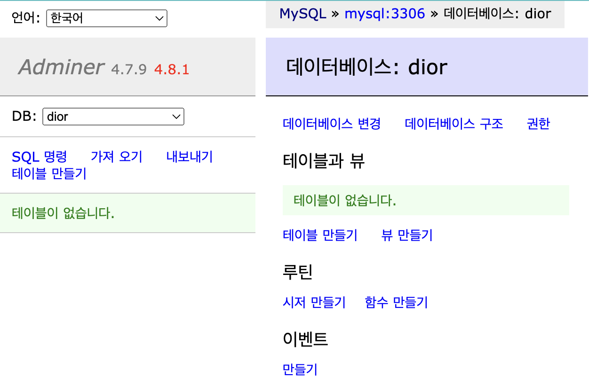

## 연습문제
mysql에 dior DB를 구축하고 adminer를 이용하여 접속하는 것을 목표로 한다.  
제시된 deployment.yaml을 참고하여 root 비밀번호는 'k8s_DB_password'로 설정하고, dior DB를 생성한다.
필요한 configMap과 secret은 따로 yaml 파일을 작성하지 않고 명령어를 통해 생성한다.

1. MYSQL_DATABASE 환경변수를 설정하는 configMap을 생성하라. (key: MYSQL_DATABASE, value: dior)
2. MYSQL_ROOT_PASSWORD 환경변수를 설정하는 secret을 생성하라. (key: MYSQL_ROOT_PASSWORD, value: k8s_DB_password)
3. deployment.yaml을 사용하여 adminer와 mysql을 배포하라.
4. adminer에서 mysql에 접근할 수 있도록 service를 생성하라.
5. adminer 웹페이지에서 dior DB에 접속하라.(adminer 서버 입력칸에 mysql:3306으로 접속)
